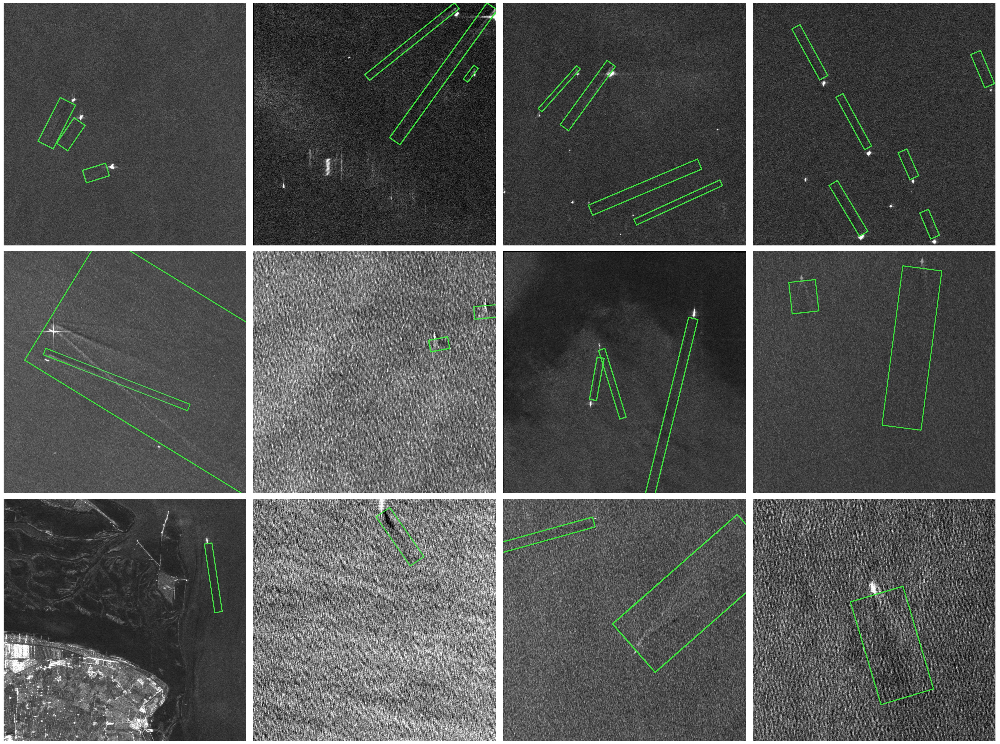

# OpenSARWake

### A SAR ship wake rotation detection benchmark dataset.

OpenSARWake is a benchmark dataset built for ship wake detection. This collection provides 3,973 images containing two polarization modes and 4,096 instances. Most importantly, it encompasses SAR images in the L-, C-, and X-bands, which have not been provided by previous datasets. The images in the dataset have spatial resolutions of 1.25 m to 12.5 m. The image size is 1024× 1024 pixels.

<div align="left">

</div>

OpenSARWake can be downloaded from [Baiduyun](https://pan.baidu.com/s/1Ji_TACJQSa_d-5lo3sb7YA?pwd=t123). We will consider uploading it to other platforms in the future.

If you have any problem, please contact me by email：xuchj9@mail2.sysu.edu.cn


**🔄Latest Updates**

----

- October 9, 2024: Added Google Drive [link](https://drive.google.com/file/d/14VkPYnb1BsmOvw_JTwtVFM-_qVpc4Udu/view?usp=sharing).

**Citation**

If you find this dataset helpful for your research, please cite this paper:

```
@ARTICLE{10507047,
  author={Xu, Chengji and Wang, Xiaoqing},
  journal={IEEE Geoscience and Remote Sensing Letters}, 
  title={OpenSARWake: A Large-Scale SAR Dataset for Ship Wake Recognition with a Feature Refinement Oriented Detector}, 
  year={2024},
  doi={10.1109/LGRS.2024.3392681}}
```
